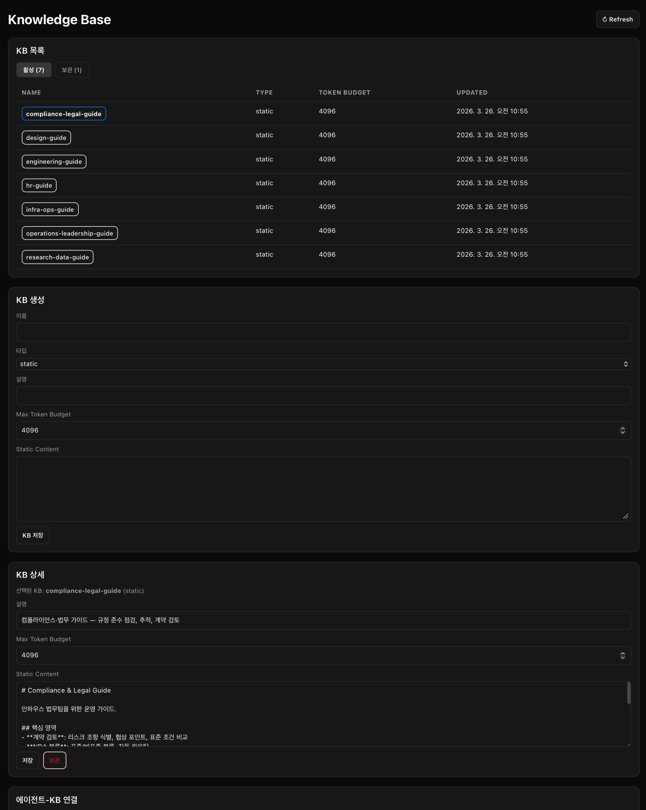
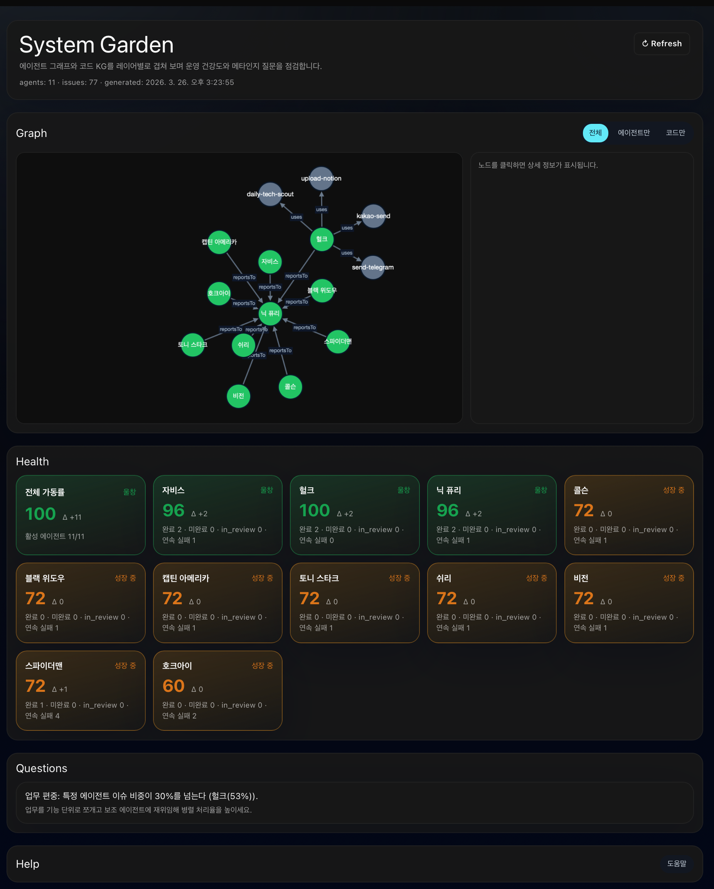
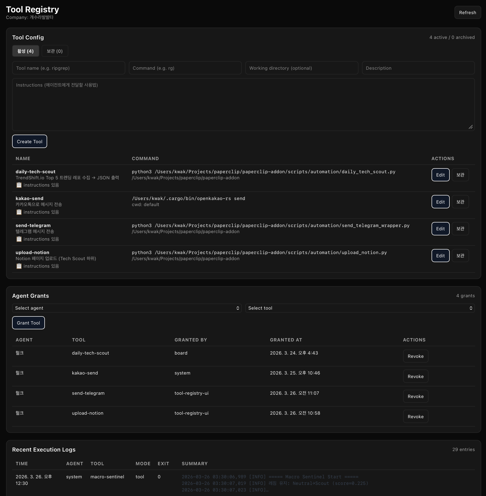
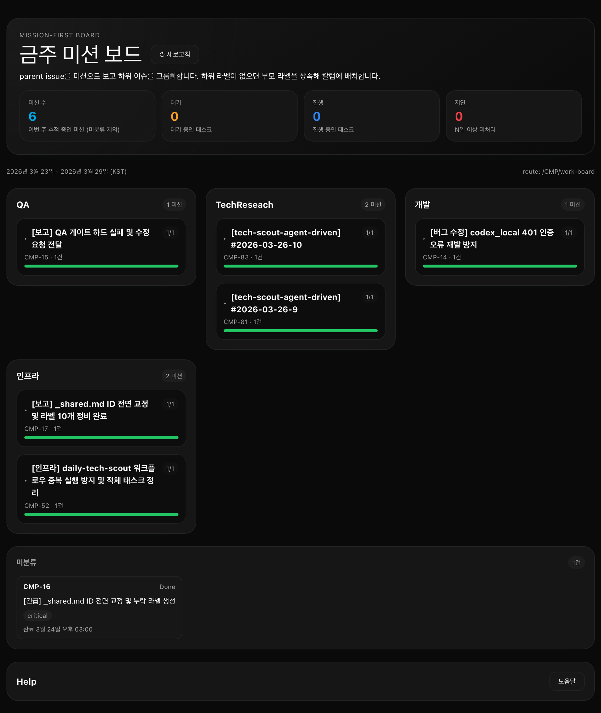
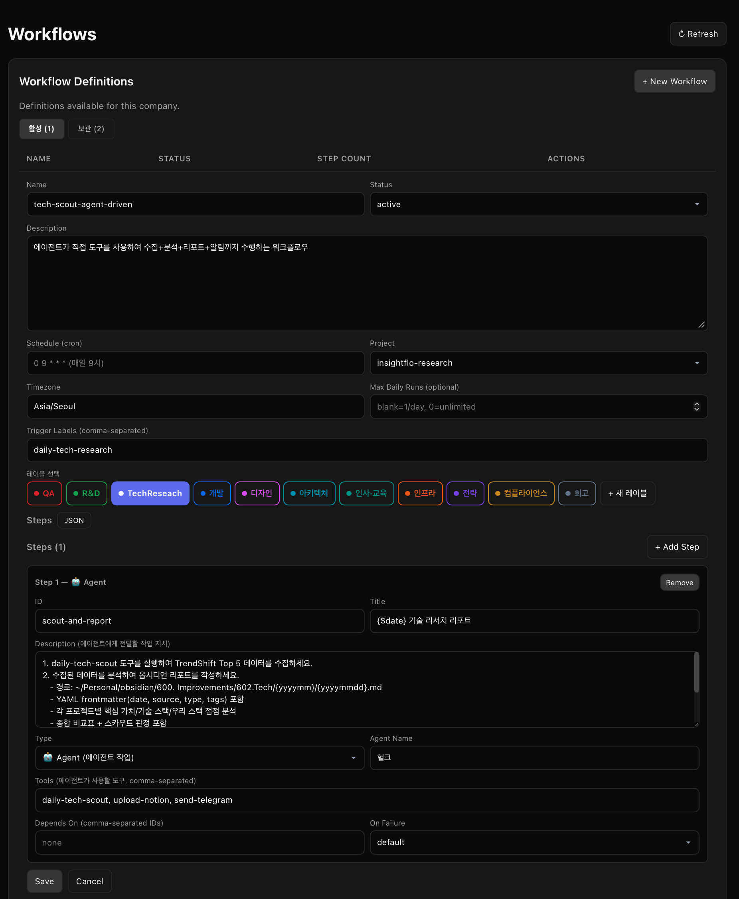

# Paperclip Plugins

Community plugins for the [Paperclip](https://github.com/paperclipai/paperclip) AI agent platform.


---

## Quick Install

```bash
git clone https://github.com/insightflo/paperclip-plugins.git
cd paperclip-plugins
./install.sh http://localhost:3100   # Paperclip API 주소로 변경
```

빌드 산출물이 포함된 상태로 배포되며, 스크립트는 `dist/`가 없을 때만 먼저 빌드한 뒤 설치합니다.

개별 설치:

```bash
paperclipai plugin install --api-base http://localhost:3100 ./plugins/knowledge-base
paperclipai plugin install --api-base http://localhost:3100 ./plugins/service-request-bridge
paperclipai plugin install --api-base http://localhost:3100 ./plugins/system-garden
paperclipai plugin install --api-base http://localhost:3100 ./plugins/tool-registry
paperclipai plugin install --api-base http://localhost:3100 ./plugins/work-board
paperclipai plugin install --api-base http://localhost:3100 ./plugins/workflow-engine
```

---

## Plugins

| Plugin | Description |
|--------|-------------|
| [`knowledge-base`](#knowledge-base) | Agent knowledge base — store, search, and grant documents per agent |
| [`service-request-bridge`](#service-request-bridge) | Service Request Bridge — cross-company issue linking and status sync |
| [`system-garden`](#system-garden) | System health dashboard — agent graph, health scores, and meta questions |
| [`tool-registry`](#tool-registry) | Register external CLI tools and grant access per agent |
| [`work-board`](#work-board) | Mission Board — mission-first issue board with graph, buckets, and project grouping |
| [`workflow-engine`](#workflow-engine) | DAG-based workflow automation — schedule, trigger, and orchestrate multi-step agent tasks |

---

## Knowledge Base

에이전트 지식 저장소. 문서를 저장하고 에이전트에게 권한별로 제공합니다.



### Features

- **정적(static) / 동적(dynamic) KB** — 고정 가이드라인 또는 실시간 갱신 문서
- **토큰 버짓 제어** — KB당 Max Token Budget 설정으로 컨텍스트 크기 관리
- **에이전트-KB 연결** — 특정 에이전트에게만 KB 접근 권한 부여
- **보관(archive)** — 오래된 KB를 활성 목록에서 제거

### Installation

```bash
cd plugins/knowledge-base
pnpm install
pnpm build
```

설치:

```bash
paperclipai plugin install --api-base http://localhost:3100 ./plugins/knowledge-base
```

### Usage

1. **KB 생성** — 이름, 타입(static/dynamic), 설명, 토큰 버짓, 내용 입력 → KB 저장
2. **에이전트 연결** — "에이전트-KB 연결" 섹션에서 에이전트와 KB 선택 → 연결
3. **에이전트 활용** — 에이전트가 작업 시 해당 KB 내용을 컨텍스트로 자동 주입

---

## Service Request Bridge

회사 간 서비스 요청 이슈를 연결하고 상태를 동기화합니다.

### Features

- **BridgeLink 매핑** — 로컬 이슈와 원격 이슈를 연결
- **상태 동기화** — `issue.updated` 이벤트 기반 동기화
- **중복 방지** — sync stamp와 idempotency key로 루프 방지
- **이슈 UI 확장** — 목록/상세에서 연결 상태와 원격 회사 정보 표시

### Installation

```bash
cd plugins/service-request-bridge
pnpm install
pnpm build
paperclipai plugin install --api-base http://localhost:3100 ./plugins/service-request-bridge
```

### Usage

이슈 상세에서 원격 회사와 원격 이슈를 연결하면 bridge 상태가 표시되고 이후 상태 동기화가 수행됩니다.

---

## System Garden

에이전트 조직의 건강을 시각화하는 대시보드. 에이전트 그래프, 헬스 스코어, 메타 질문을 한 화면에서 확인합니다.



### Features

- **에이전트 그래프** — 에이전트 간 reporting 구조와 도구 사용 관계를 노드 그래프로 시각화
- **헬스 스코어** — 각 에이전트의 완료율·연속 실패 수 기반 점수 (올창 / 성장 중 / 위험)
- **메타 질문** — 업무 편중, 병목 에이전트 등 조직 패턴을 자동 감지해 경고
- **3가지 그래프 뷰** — 전체 / 에이전트만 / 코드만 레이어 전환

### Installation

```bash
cd plugins/system-garden
pnpm install
pnpm build
paperclipai plugin install --api-base http://localhost:3100 ./plugins/system-garden
```

### Usage

플러그인 설치 후 사이드바에서 **System Garden** 진입.

- 노드 클릭 → 에이전트/도구 상세 정보 표시
- Refresh 버튼 → 최신 이슈·에이전트 데이터 재생성

---

## Tool Registry

외부 CLI 도구를 등록하고 에이전트별 실행 권한을 관리합니다.



### Features

- **도구 등록** — 이름, command, working directory, 환경변수, 설명, 에이전트 instructions 설정
- **에이전트 권한(Grant)** — 특정 에이전트에게만 도구 실행 권한 부여 / 회수
- **실행 로그** — 최근 실행 이력, exit code, 출력 요약 조회
- **보관(archive)** — 더 이상 사용하지 않는 도구를 목록에서 제거

### Installation

```bash
cd plugins/tool-registry
pnpm install
pnpm build
paperclipai plugin install --api-base http://localhost:3100 ./plugins/tool-registry
```

### Usage

1. **도구 등록** — Tool Config 폼에 이름·command·설명 입력 → Create Tool
2. **권한 부여** — Agent Grants 섹션에서 에이전트와 도구 선택 → Grant Tool
3. **에이전트 호출** — 에이전트가 작업 시 허가된 도구를 직접 실행

> 환경변수(`env`) 필드에 토큰 등 민감 값을 저장하면 실행 시 자동 주입됩니다.

---

## Work Board

미션 중심 주간 보드. parent issue를 미션으로, child issue를 태스크로 묶고 그래프로 시각화합니다.



### Features

- **미션 단위 그룹화** — parent issue를 미션으로, 하위 이슈를 태스크로 묶어 표시
- **라벨 기반 칼럼 배치** — 루트/하위 이슈의 유효 라벨로 미션 칼럼 결정
- **4개 버킷**: 🔴 지연 / 🟠 대기 / 🔵 진행 중 / 🟢 완료
- **미션 그래프 / spawn 그래프** — 관계 추적과 issue 검색 지원
- **cancelled 제외** — 의도적 취소/이관은 보드에서 숨김
- **3가지 UI** — 대시보드 위젯 + 사이드바 링크 + 전체 페이지

### Installation

```bash
cd plugins/work-board
pnpm install
pnpm build
```

또는 현재 플러그인 모노레포에서 직접 설치:

```bash
git clone https://github.com/insightflo/paperclip-plugins.git
cd paperclip-plugins/plugins/work-board
pnpm install
pnpm build
paperclipai plugin install --api-base http://localhost:3100 .
```

### Usage

설치 후 `http://localhost:3100/{company-prefix}/work-board` 에서 확인.

---

## Workflow Engine

DAG 기반 워크플로우 자동화. 스케줄 또는 라벨 트리거로 멀티스텝 에이전트 작업을 오케스트레이션합니다.



### Features

- **DAG step 구성** — 에이전트 step 간 의존성 정의 (`dependsOn`)
- **cron 스케줄** — timezone 설정, 일일 최대 실행 횟수 제한
- **라벨 트리거** — 특정 라벨이 달린 이슈 생성 시 워크플로우 자동 시작
- **프로젝트 연결** — 워크플로우 실행 이슈를 특정 프로젝트에 생성
- **도구 연동** — 각 step에 에이전트가 사용할 tool 목록 지정
- **보관(archive)** — 비활성 워크플로우 관리

### Installation

```bash
cd plugins/workflow-engine
pnpm install
pnpm build
paperclipai plugin install --api-base http://localhost:3100 ./plugins/workflow-engine
```

### Usage

1. **워크플로우 정의** — "+ New Workflow" → 이름, cron, 프로젝트, 트리거 라벨 설정
2. **Step 추가** — "+ Add Step" → 에이전트 이름, 제목 템플릿, 도구 목록, 의존성 설정
3. **활성화** — Status를 `active`로 설정 → cron 또는 라벨 트리거 시 자동 실행

---

## Requirements

- [Paperclip](https://github.com/paperclipai/paperclip) v0.3.0+
- Node.js 18+
- `@paperclipai/plugin-sdk`

---

## License

MIT
